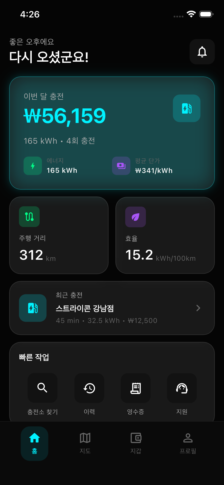
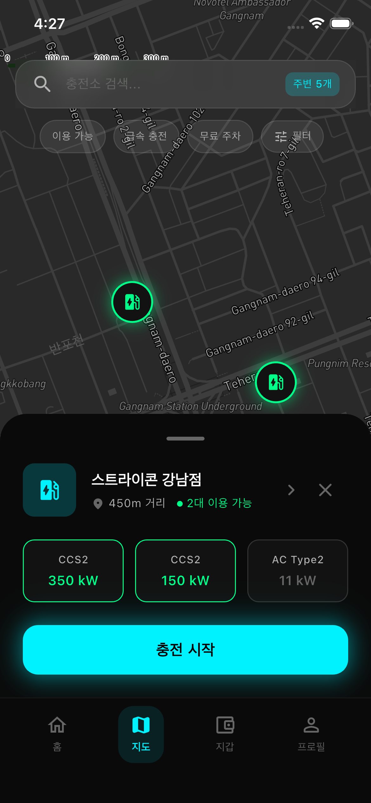
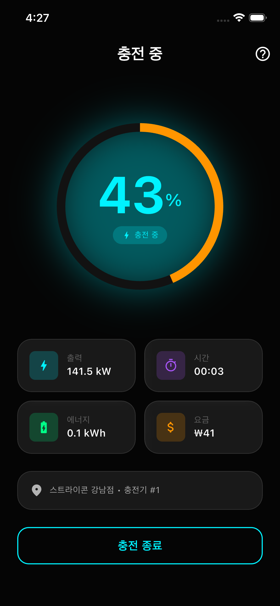
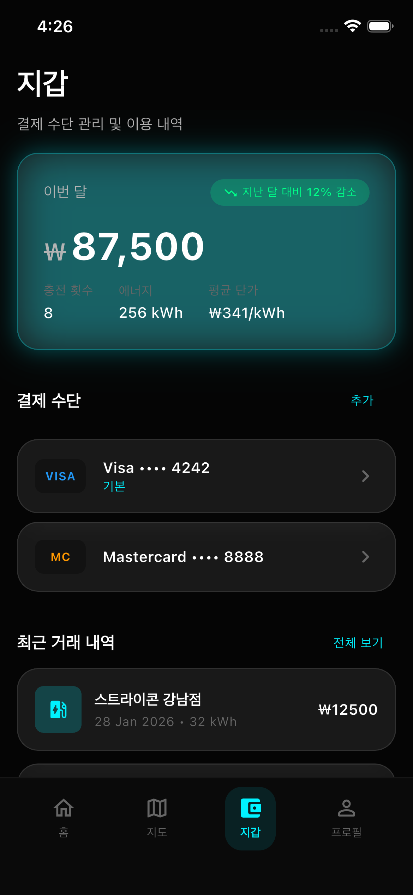

<div align="center">

# ⚡ EnergyFi

### The DeFi Layer for Real-World Energy Infrastructure

**Log locally (Subnet) · Settle globally (C-Chain) · Earn everywhere (App)**

[](https://www.avax.network/)
[](https://soliditylang.org/)
[](https://hardhat.org/)
[](https://flutter.dev/)

</div>

---

## 💡 TL;DR

> Built **on top of [STRIKON](https://strikon.io)**, a production EV-charging platform already running **130+ microservices**.
> EnergyFi **tokenises charging-station revenue (STO)** and adds a **P2P trading + revenue distribution DeFi layer**.

This is not a blank-slate hackathon project — real-time production data flows straight on-chain.

---

## 🖼 STRIKON Platform — Already in Production

> The screenshots below are from the live STRIKON app. EnergyFi reads charging-station data from this platform and feeds it into the tokenisation pipeline.

<div align="center">
<table>
<tr>
<td align="center"><b>Login</b></td>
<td align="center"><b>Home Dashboard</b></td>
<td align="center"><b>Station Map</b></td>
<td align="center"><b>Live Charging</b></td>
<td align="center"><b>Wallet & History</b></td>
</tr>
<tr>
<td></td>
<td></td>
<td></td>
<td></td>
<td></td>
</tr>
</table>
</div>

> **In production, live data is served by the STRIKON Platform API.**
> For the hackathon demo, the same flow runs on realistic mock JSON.

---

## 🏗 Architecture

> 🔗 **[View Interactive Architecture Diagram](https://htmlpreview.github.io/?https://github.com/your-org/EnergyFi/blob/main/docs/architecture-diagram.html)** — explore the full system architecture in your browser.

```
                    ┌─────────────────────────┐
                    │      Flutter App 📱      │
                    │  Wallet · Trade · Claim   │
                    └────────────┬────────────┘
                                 │
                    ┌────────────▼────────────┐
                    │   Avalanche C-Chain (L1) │
                    │                          │
                    │  EnergyToken (ERC-3643)   │
                    │  EnergyDEX  · EnergyOracle│
                    │  RevenueVault             │
                    └──────┬──────────▲────────┘
                     AWM   │          │  Oracle Relay
                           │          │  (TypeScript)
                    ┌──────▼──────┐   │
                    │  Wingside   │   │
                    │  Subnet (L2)│   │
                    │  AssetLogger│   │
                    │  DeviceReg. │   │
                    └─────────────┘   │
                                      │
              ┌───────────────────────┤
              │                       │
     ┌────────▼────────┐    ┌────────▼────────┐
     │  APEX Engine    │    │  STRIKON API    │
     │  (AI Valuation) │◄───│  (130+ μServices│
     │  Claude API     │    │   in production)│
     └─────────────────┘    └─────────────────┘
```

### Hybrid Topology

| Layer | Network | Role | Tech Stack |
| :--- | :--- | :--- | :--- |
| **L2 Execution** | Wingside Subnet | DER data logging, high TPS | Subnet-EVM, Solidity ^0.8.20 |
| **L1 Settlement** | Avalanche C-Chain | STO tokenisation, DeFi, revenue distribution | ERC-3643, Hardhat 3 |
| **Bridge** | Teleporter | L2 → L1 state sync | AWM (Avalanche Warp Messaging) |
| **Oracle** | Oracle Relay | Off-chain data → on-chain | TypeScript, Node.js 24, ethers.js |
| **AI** | APEX Engine | Asset valuation (NPV / IRR) | Claude API |
| **App** | Flutter | Mobile client | Riverpod, web3dart, WalletConnect |

---

## 🔄 Token Lifecycle

```
Real-time station data (kWh, revenue)
        │
        ▼
  ① STRIKON API (or Mock JSON)
        │
        ▼
  ② APEX Engine ─── AI valuation (NPV, IRR, risk grade)
        │
        ▼
  ③ Oracle Relay ─── record on-chain via EnergyOracle.sol
        │
        ▼
  ④ EnergyToken.sol ─── ERC-3643 STO issuance (KYC whitelist)
        │
        ▼
  ⑤ EnergyDEX ─── P2P buy / sell order matching
        │
        ▼
  ⑥ RevenueVault ─── station revenue → USDC dividends to holders
        │
        ▼
  ⑦ Flutter App ─── users view & claim earnings
```

---

## 📂 Repository Structure

```
EnergyFi/
├── contracts/
│   ├── c-chain/              # L1 Settlement contracts
│   │   ├── contracts/
│   │   │   ├── EnergyToken.sol      # ERC-3643 STO token
│   │   │   ├── EnergyOracle.sol     # Off-chain data receiver
│   │   │   └── RevenueVault.sol     # Revenue distribution vault
│   │   ├── scripts/                 # Deploy scripts
│   │   └── hardhat.config.ts        # Hardhat 3 (ESM)
│   │
│   └── subnet/               # L2 Execution contracts
│       ├── contracts/
│       │   ├── AssetLogger.sol      # DER event logging
│       │   └── DeviceRegistry.sol   # IoT device RBAC
│       ├── scripts/
│       └── hardhat.config.ts
│
├── services/
│   └── oracle-relay/          # Off-chain → on-chain bridge
│       └── index.ts
│
├── subnet-evm/                # Wingside Subnet config
│   ├── genesis.json
│   └── config.json
│
├── frontend/                  # Flutter mobile app
│   ├── lib/
│   │   ├── main.dart
│   │   └── config/constants.dart
│   └── pubspec.yaml
│
├── docs/                      # Project documentation
│   ├── 01_Architecture.md
│   ├── 02_Smart_Contract_Spec.md
│   ├── 03_Environment_Setup.md
│   ├── 04_Deployment_Guide.md
│   └── 05_Regulatory_Framework.md
│
└── .env.example               # Environment variable template
```

---

## 🛠 Tech Stack

| Category | Technology | Version |
| :--- | :--- | :--- |
| Runtime | Node.js | 24.13.1 LTS |
| Smart Contract | Solidity | ^0.8.20 |
| Framework | Hardhat | 3.1.7 (ESM-first) |
| Token Standard | ERC-3643 | Security Token |
| Library | OpenZeppelin Contracts | ^5.3.0 |
| Web3 | ethers.js | ^6.14.0 |
| Language | TypeScript | ^5.7.0 |
| Mobile | Flutter | ^3.7.0 |
| State Mgmt | Riverpod | ^2.4.0 |
| Blockchain | Avalanche | C-Chain + Custom Subnet |

---

## 🚀 Quick Start

### Prerequisites

- **Node.js** ≥ 24.x (LTS)
- **Flutter** ≥ 3.7.0
- **Git**

### 1. Clone & Install

```bash
git clone https://github.com/your-org/EnergyFi.git
cd EnergyFi

# C-Chain contracts
cd contracts/c-chain && npm install

# Subnet contracts
cd ../subnet && npm install

# Oracle Relay
cd ../../services/oracle-relay && npm install
```

### 2. Compile Contracts

```bash
cd contracts/c-chain && npx hardhat compile   # → solc 0.8.20
cd ../subnet && npx hardhat compile
```

### 3. Environment Setup

```bash
cp .env.example .env
# Fill in your private key and RPC endpoint
```

### 4. Flutter App

```bash
cd frontend
flutter pub get
flutter run
```

> 📖 Full guide: [docs/03_Environment_Setup.md](docs/03_Environment_Setup.md)

---

## 📅 6-Week Roadmap

### Week 1–2: Foundation
- [ ] STO smart contracts on Avalanche C-Chain (Solidity, lightweight ERC-3643)
- [ ] Flutter project setup + wallet integration (WalletConnect or built-in wallet)
- [ ] STRIKON charging-station mock API

### Week 3–4: Core Features
- [ ] Station revenue data → token issuance flow
- [ ] P2P trading screen (AMM or simplified order book)
- [ ] AI valuation module (APEX concept — token price recommendation based on station profitability)

### Week 5: Integration & Polish
- [ ] End-to-end flow (issuance → trade → revenue distribution)
- [ ] UI / UX refinement
- [ ] Edge-case handling

### Week 6: Demo Prep
- [ ] Pitch deck + demo video production
- [ ] Scenario-based live demo rehearsal
- [ ] Documentation (GitHub README, architecture diagrams)

---

## 🎯 What Makes This Different

| Typical Hackathon Team | EnergyFi |
| :--- | :--- |
| Starts from scratch | **Built on STRIKON — a platform already running 130+ microservices** |
| Mock data only | Grounded in real charging-station data from live infrastructure |
| Web demo level | **Flutter native mobile app — real user experience** |
| Proof of concept | Production-ready architecture (Subnet L2 + C-Chain L1) |

> *"We already have a platform in production — this hackathon project is the DeFi layer on top of it."*

---

## 📚 Documentation

| Document | Description |
| :--- | :--- |
| [**Architecture Diagram (Interactive)**](docs/architecture-diagram.html) | Interactive system architecture (HTML) |
| [00_Project_Overview.md](docs/00_Project_Overview.md) | Project vision, differentiators, tech stack |
| [01_Architecture.md](docs/01_Architecture.md) | System architecture & hybrid topology |
| [02_Smart_Contract_Spec.md](docs/02_Smart_Contract_Spec.md) | Smart contract specifications (Phase 1/2) |
| [03_Environment_Setup.md](docs/03_Environment_Setup.md) | Development environment setup |
| [04_Deployment_Guide.md](docs/04_Deployment_Guide.md) | 5-unit deployment procedure |
| [05_Regulatory_Framework.md](docs/05_Regulatory_Framework.md) | Regulatory & compliance framework |
| [06_Oracle_Relay_Spec.md](docs/06_Oracle_Relay_Spec.md) | Oracle Relay service specification |
| [07_Frontend_Spec.md](docs/07_Frontend_Spec.md) | Flutter mobile app specification |
| [08_Token_Lifecycle.md](docs/08_Token_Lifecycle.md) | Token lifecycle: Data → Yield |

---

## 📄 License

MIT © 2026 Wingside AI EnergyFi Team
