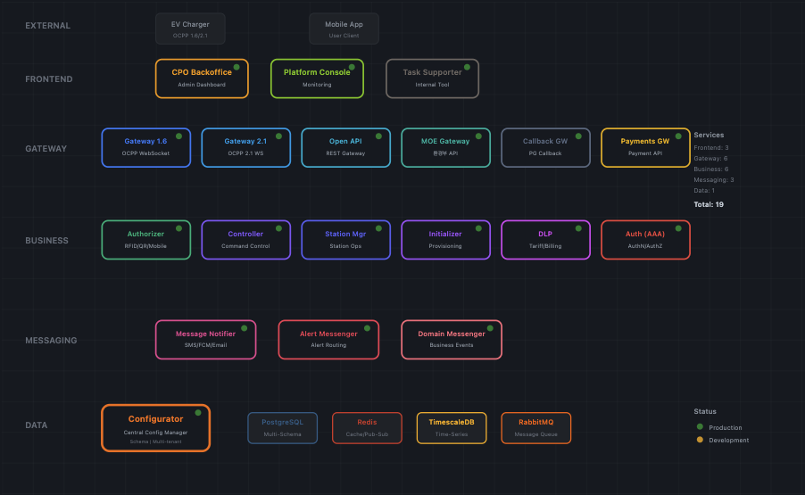
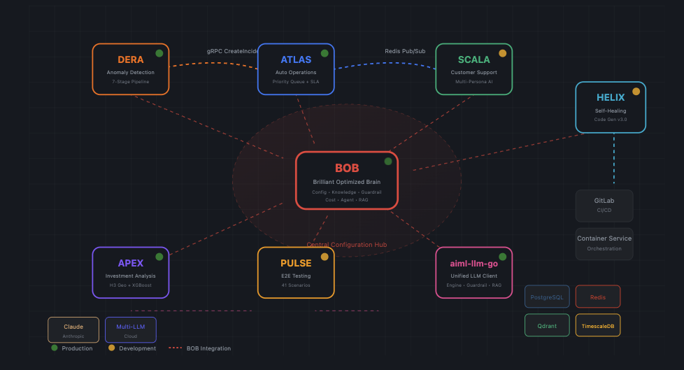
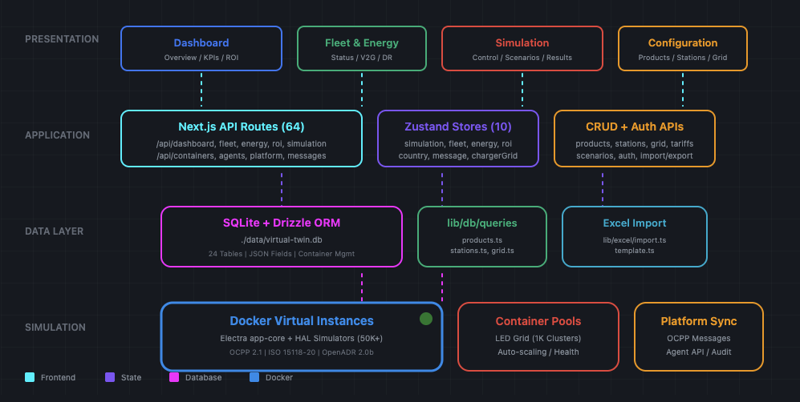

<div align="center">

# EnergyFi
### Powered by STRIKON

### Hardware-Anchored RWA — Real-Time Infrastructure Finance on Avalanche

<br/>


<br/>


[](https://www.avax.network/)
[](https://en.wikipedia.org/wiki/Trusted_Platform_Module)
[](https://soliditylang.org/)
[](https://flutter.dev/)

</div>

---

## What is EnergyFi?

EnergyFi is the blockchain protocol powering **STRIKON**, the world's first AI-native EV charging infrastructure.

Unlike traditional RWA projects that rely on third-party APIs (Software Trust), EnergyFi leverages a **Hardware Anchor (TPM 2.0)** embedded in every charger. We tokenize the charging infrastructure itself, allowing investors to own a piece of the hardware and receive **real-time dividends** from charging revenue, verified directly from the chip to the chain.

> **Note:** While our roadmap includes V2G (Vehicle-to-Grid) technology for future power grid interaction, our current core STO focuses on **infrastructure asset securitization** and **charging revenue distribution**.

```mermaid
flowchart LR
    subgraph Hardware["Hardware Anchor (Trust Source)"]
        A[EV Charger] -->|Sign Data| B[TPM 2.0 Chip]
    end

    subgraph Blockchain["Avalanche Infrastructure"]
        B -->|Signed Telemetry| C[EnergyFi Subnet\n(Evergreen Compatible)]
        C -->|Verified Revenue| D[Smart Contract\n(Yield Distribution)]
    end

    subgraph User["Investor Experience"]
        D -->|Real-Time Settlement| E[Investor Wallet]
    end

    style Hardware fill:#222,stroke:#fff,stroke-width:2px
    style B fill:#E84142,stroke:#fff,stroke-width:2px,color:#fff
    style Blockchain fill:#1a1a2e,stroke:#E84142
    style C fill:#1a1a2e,stroke:#E84142,stroke-dasharray: 5 5
```


## Why We Are Different: The Hardware Anchor

Most RWA projects suffer from the **"Oracle Problem"**—if the physical data is tampered with before it hits the blockchain, the on-chain asset is worthless.

EnergyFi solves this at the source:

| Feature | Legacy RWA | EnergyFi (STRIKON) |
| :--- | :--- | :--- |
| **Data Source** | Third-party API (modifiable) | **TPM 2.0 / SE Module** (Physical Chip) |
| **Verification** | Manual Audit / Trusting the API provider | **Cryptographic Signing** at Hardware Level |
| **Settlement** | T+2 Days / Quarterly Dividends | **Real-Time** (Second-by-Second Yield) |
| **Security** | Software Level | **Hardware Level** (Anti-Tamper) |

**"Code is Law"**: By securing data at the chip level, we eliminate the need for costly manual verification by brokerage firms, enabling a true **Trustless Architecture**.

---
## The Foundation — Already Built

EnergyFi is not starting from zero. It sits on top of two production-grade systems built by Wingside:

### STRIKON Platform — The Data Source

<div align="center">

<br/><br/>
<table>
<tr>
<td align="center"><b>Mobile App</b></td>
<td align="center"><b>Platform Architecture (30+ microservices)</b></td>
</tr>
<tr>
<td></td>
<td></td>
</tr>
</table>
</div>

> 🔗 [View interactive platform architecture](https://htmlpreview.github.io/?https://github.com/Seon-ung/EnergyFi/blob/main/docs/assets/strikon_platform_architecture.html)

STRIKON is the **EV charging platform** that operates the physical stations — 30+ microservices handling charger management, billing, real-time monitoring, and revenue tracking. **6 specialised AI agents** automate demand forecasting, pricing, maintenance scheduling, and fleet routing — cutting operational costs by replacing manual processes with autonomous decision-making. Launching June 2026.

### APEX Engine — The AI Brain

<div align="center">
<table>
<tr>
<td align="center"><b>APEX Dashboard</b></td>
<td align="center"><b>AI Agent Architecture (6 agents)</b></td>
</tr>
<tr>
<td></td>
<td></td>
</tr>
</table>
</div>

> 🔗 [View interactive AI agent architecture](https://htmlpreview.github.io/?https://github.com/Seon-ung/EnergyFi/blob/main/docs/assets/ai_agent_architecture.html)

APEX analyses every charging station and produces **investment-grade intelligence**:

| Output | Detail |
| :--- | :--- |
| **Investment Score** | NPV, IRR, payback period — per station |
| **Risk Grade** | Revenue stability, utilization trend, equipment health, competition |
| **AI Signal** | UNDERVALUED / FAIR VALUE / OVERVALUED |
| **Revenue Forecast** | Monthly projections with confidence intervals |

> 📖 Full interface schema: [09_Interface_Spec.md](docs/09_Interface_Spec.md)

### What EnergyFi Adds

EnergyFi is the **blockchain layer** that connects these systems to Avalanche:

| STRIKON provides | APEX provides | EnergyFi does |
| :--- | :--- | :--- |
| kWh dispensed, revenue, uptime | Fair value, risk score, yield forecast | **Tokenise** the station as an STO |
| Real-time charger health | Buy/sell signal per station | **Trade** tokens P2P on-chain |
| Monthly financial reports | Portfolio optimisation | **Distribute** yield to token holders |

> **Hackathon demo**: mock JSON matching production schema · **At launch (June 2026)**: live data via STRIKON API

###  Virtual Twin — Reliability

To ensure financial accuracy, every AI decision is regression-tested in our **Virtual Twin** environment before deployment. We don't guess; we simulate.

<div align="center">

</div>

> 🔗 [View interactive Virtual Twin architecture](https://htmlpreview.github.io/?https://github.com/Seon-ung/EnergyFi/blob/main/docs/assets/virtual_twin_architecture.html)
---


## Why Avalanche?

| Need | Solution | Why only Avalanche? |
| :--- | :--- | :--- |
| **Regulatory speed** | ERC-3643 + Subnet permissioning | Compliance-ready out of the box — no custom framework needed |
| **Global capital pipeline** | C-Chain (public L1) | Institutional DeFi ecosystem to connect Korean RWA assets with global liquidity |
| **IoT-scale data ingestion** | Wingside Subnet (custom L2) | Sovereign chain with near-instant finality and low gas for high-frequency device data |
| **FinTech-grade reliability** | Avalanche consensus | Absolute finality and data consistency required for securities settlement |

Avalanche is the only ecosystem where you can **spin up a dedicated chain for your use case** while settling on a shared, liquid public chain — without a third-party bridge.

## Avalanche Strategy: Built for Institutions

We are not just building a private subnet; we are building an **Institutional-Ready Infrastructure** aligned with **Avalanche Evergreen** standards.

### 1. Private Subnet for Data Security
* **Purpose:** Handling high-frequency IoT data (voltage, amperage, session logs) requires zero latency and zero gas costs for devices.
* **Security:** Our private subnet ensures that sensitive raw data is processed securely before yield data is bridged to the public chain.

### 2. Evergreen Compatibility (Future-Proofing)
* **Standardization:** We adopt the data standards and permissioning structures used by **Spruce** and **Intain** (Avalanche's institutional subnets).
* **Interoperability:** This design ensures that when EnergyFi STOs are ready for global liquidity, they can seamlessly connect with Wall Street institutions and regulated DeFi protocols on the Avalanche network.

---

## The "Infinite Snowball" Model

EnergyFi introduces a self-replicating economic model powered by AI and Blockchain transparency.

* **30% Avalanche Foundation:** Token buy-back & burn to defend ecosystem value.
* **20% Operations:** Funding for **HELIX** (Self-healing AI) and **APEX** (Investment AI) development.
* **50% Re-investment (The Snowball):** Automatically allocated to manufacture and install *new* chargers.
    * *Result:* The infrastructure grows geometrically without needing continuous external capital injection.

---

## Architecture

<div align="center">

</div>

> 🔗 [View interactive version with hover details](https://htmlpreview.github.io/?https://github.com/Seon-ung/EnergyFi/blob/main/docs/architecture-diagram.html)

---

## Token Lifecycle

**From Hardware to Handheld Yield** — How real-world utilization turns into investor profit:

| Step | Component | Action & Logic |
| :---: | :--- | :--- |
| ① | **STRIKON API** | **Data Generation:** Real-time kWh & revenue logs (Signed by TPM). |
| ② | **APEX Engine** | **Valuation:** AI calculates risk scores and fair value dynamically. |
| ③ | **EnergyToken** | **Asset Tokenization:** Investors fund hardware via STO (ERC-3643). |
| ④ | **Oracle Relay** | **Bridge:** Verifies off-chain revenue data and pushes it on-chain. |
| ⑤ | **RevenueVault** | **Distribution:** Converts fiat revenue to **Stablecoins (USDC)** and distributes yield via Smart Contracts. |
| ⑥ | **EnergyDEX** | **Liquidity:** P2P trading of security tokens *(Phase 2)*. |
| ⑦ | **Flutter App** | **Claim:** Investors view real-time APY and claim dividends. |

> 📖 Full detail: [08_Token_Lifecycle.md](docs/08_Token_Lifecycle.md)

---

## Regulatory Roadmap: 2026 STO Act

We are preparing for the enforcement of South Korea's **Electronic Securities Act (Jan 2026)**.

* **Goal:** Obtain status as a **"Self-Issuing Account Management Institution"**.
* **Strategy:** By proving that our **Hardware Anchor + Blockchain Ledger** provides higher transparency than human auditors, we aim to bypass traditional brokerage intermediaries.
* **Current Status:** Technical Due Diligence (Retro9000 Proposal) in progress.

---

## Future Expansion: V2G & VPP

While our current focus is on the **Charging Station STO**, the hardware is future-proofed for:

* **V2G (Vehicle-to-Grid):** Turning EVs into mobile batteries to stabilize the grid.
* **VPP (Virtual Power Plant):** Aggregating distributed chargers to trade power.

*These features will be activated in Phase 3 (Global Standard), creating additional revenue streams for STO holders beyond simple charging fees.*

---

## 🛠️ Technology Stack

EnergyFi connects established hardware infrastructure with the Avalanche blockchain.

| Layer | Component  | Technology |
| :--- | :--- | :--- |
| **Asset (Off-chain)** | **EV Charger** | Custom Hardware, TPM 2.0, metering IC |
| **Platform (Off-chain)** | **STRIKON** | Node.js microservices, Python AI Agents (APEX) |
| **Protocol (On-chain)** | **EnergyFi** | **Solidity ^0.8.20**, **Avalanche Subnet**, Hardhat |
| **Interface** | **App** | Flutter, WalletConnect v2, ethers.js |

> **Hackathon Focus:** During this hackathon, we built the **EnergyFi Protocol** (Smart Contracts & Subnet config) and the **Oracle Relay** that connects the live TPM data from STRIKON to the Avalanche blockchain.
---

## Documentation

| Document | Description |
| :--- | :--- |
| [**Architecture Diagram**](docs/architecture-diagram.html) | Interactive system architecture (HTML) |
| [00 Project Overview](docs/00_Project_Overview.md) | Vision, differentiators, tech stack |
| [01 Architecture](docs/01_Architecture.md) | System architecture & hybrid topology |
| [02 Smart Contract Spec](docs/02_Smart_Contract_Spec.md) | Contract specifications (Phase 1 / 2) |
| [03 Environment Setup](docs/03_Environment_Setup.md) | Development environment setup |
| [04 Deployment Guide](docs/04_Deployment_Guide.md) | 5-unit deployment procedure |
| [05 Regulatory Framework](docs/05_Regulatory_Framework.md) | Regulatory & compliance |
| [06 Oracle Relay Spec](docs/06_Oracle_Relay_Spec.md) | Oracle Relay service spec |
| [07 Frontend Spec](docs/07_Frontend_Spec.md) | Flutter mobile app spec |
| [08 Token Lifecycle](docs/08_Token_Lifecycle.md) | Token lifecycle: Data → Yield |
| [09 Interface Spec](docs/09_Interface_Spec.md) | STRIKON ↔ EnergyFi interface schemas (8 APIs) |

<details>
<summary><b>Quick Start (click to expand)</b></summary>

```bash
git clone https://github.com/Seon-ung/EnergyFi.git
cd EnergyFi

# Smart Contracts
cd contracts/c-chain && npm install && npx hardhat compile
cd ../subnet && npm install && npx hardhat compile

# Oracle Relay
cd ../../services/oracle-relay && npm install

# Flutter App
cd ../../frontend && flutter pub get && flutter run
```

> 📖 Full guide: [03_Environment_Setup.md](docs/03_Environment_Setup.md)

</details>

---

## License

MIT © 2026 Wingside AI EnergyFi Team