<div align="center">

# EnergyFi

### Energy RWA — Tokenising Real Infrastructure on Avalanche

<br/>


<br/>
<sub>by <b>Wingside AI</b></sub>

[](https://www.avax.network/)
[](https://soliditylang.org/)
[](https://hardhat.org/)
[](https://flutter.dev/)

</div>

---

## What is EnergyFi?

EnergyFi turns **real energy infrastructure** — starting with EV charging stations — into **on-chain securities (STO)** that anyone can invest in, trade, and earn yield from.

```mermaid
flowchart LR
    A[Charging Station] --> B[STRIKON]
    C[APEX Engine] <--> B
    B --> D[EnergyFi]
    D --> E[Avalanche Subnet\nIoT · Device Data]
    D --> F[Avalanche C-Chain\nSTO · Trading · Yield]

    style A fill:#1a1a2e,stroke:#10b981,color:#e0e0e0
    style B fill:#1a1a2e,stroke:#10b981,stroke-width:2px,color:#10b981
    style C fill:#1a1a2e,stroke:#00f5ff,stroke-width:2px,color:#00f5ff
    style D fill:#1a1a2e,stroke:#E84142,stroke-width:3px,color:#E84142
    style E fill:#1a1a2e,stroke:#f59e0b,stroke-width:2px,color:#f59e0b
    style F fill:#1a1a2e,stroke:#E84142,stroke-width:2px,color:#E84142
```



**The flow**: Real station data → AI valuation → On-chain STO → Investor yield.

South Korea's **STO Act passed on Jan 15 2026** with a 1-year grace period — EnergyFi is being built to capture this market on Avalanche.

---

## The Foundation — Already Built

EnergyFi is not starting from zero. It sits on top of two production-grade systems built by Wingside:

### STRIKON Platform — The Data Source

<div align="center">

<br/><br/>
<table>
<tr>
<td align="center"><b>Mobile App</b></td>
<td align="center"><b>Platform Architecture (30+ microservices)</b></td>
</tr>
<tr>
<td></td>
<td></td>
</tr>
</table>
</div>

> 🔗 [View interactive platform architecture](https://htmlpreview.github.io/?https://github.com/Seon-ung/EnergyFi/blob/main/docs/assets/strikon_platform_architecture.html)

STRIKON is the **EV charging platform** that operates the physical stations — 30+ microservices handling charger management, billing, real-time monitoring, and revenue tracking. **6 specialised AI agents** automate demand forecasting, pricing, maintenance scheduling, and fleet routing — cutting operational costs by replacing manual processes with autonomous decision-making. Launching June 2026.

### APEX Engine — The AI Brain

<div align="center">
<table>
<tr>
<td align="center"><b>APEX Dashboard</b></td>
<td align="center"><b>AI Agent Architecture (6 agents)</b></td>
</tr>
<tr>
<td></td>
<td></td>
</tr>
</table>
</div>

> 🔗 [View interactive AI agent architecture](https://htmlpreview.github.io/?https://github.com/Seon-ung/EnergyFi/blob/main/docs/assets/ai_agent_architecture.html)

APEX analyses every charging station and produces **investment-grade intelligence**:

| Output | Detail |
| :--- | :--- |
| **Investment Score** | NPV, IRR, payback period — per station |
| **Risk Grade** | Revenue stability, utilization trend, equipment health, competition |
| **AI Signal** | UNDERVALUED / FAIR VALUE / OVERVALUED |
| **Revenue Forecast** | Monthly projections with confidence intervals |

> 📖 Full interface schema: [09_Interface_Spec.md](docs/09_Interface_Spec.md)

### What EnergyFi Adds

EnergyFi is the **blockchain layer** that connects these systems to Avalanche:

| STRIKON provides | APEX provides | EnergyFi does |
| :--- | :--- | :--- |
| kWh dispensed, revenue, uptime | Fair value, risk score, yield forecast | **Tokenise** the station as an STO |
| Real-time charger health | Buy/sell signal per station | **Trade** tokens P2P on-chain |
| Monthly financial reports | Portfolio optimisation | **Distribute** yield to token holders |

> **Hackathon demo**: mock JSON matching production schema · **At launch (June 2026)**: live data via STRIKON API

---

## Why Avalanche?

| Need | Solution | Why only Avalanche? |
| :--- | :--- | :--- |
| **Regulatory speed** | ERC-3643 + Subnet permissioning | Compliance-ready out of the box — no custom framework needed |
| **Global capital pipeline** | C-Chain (public L1) | Institutional DeFi ecosystem to connect Korean RWA assets with global liquidity |
| **IoT-scale data ingestion** | Wingside Subnet (custom L2) | Sovereign chain with near-instant finality and low gas for high-frequency device data |
| **FinTech-grade reliability** | Avalanche consensus | Absolute finality and data consistency required for securities settlement |

Avalanche is the only ecosystem where you can **spin up a dedicated chain for your use case** while settling on a shared, liquid public chain — without a third-party bridge.

---

## Why Now?

South Korea's **STO Act passed on Jan 15 2026** with a **1-year grace period**. Teams that ship first will set the standard.

| Signal | What it means |
| :--- | :--- |
| **STO Act (Jan 15 2026)** | Tokenised securities on real-world assets are now legal — first-mover advantage is critical |
| **V2G growth** | EV batteries absorb surplus energy, sell back to grid — our beachhead market |
| **AI datacenter boom → nuclear** | Nuclear can't ramp down — surplus energy needs distributed storage like V2G |
| **Beyond EV charging** | Same architecture extends to ESS, solar, and other distributed energy resources |

---

## Why This Team — Chip-to-Chain

Most RWA projects start at the API layer and trust external data. **We start at the hardware.**

```
Chip  →  Firmware  →  Embedded  →  Platform (STRIKON)  →  Blockchain (Avalanche)
└─────── Built by Wingside (20+ years hardware leadership) ──────┘   └── EnergyFi ──┘
```

| Layer | What we control | Why it matters |
| :--- | :--- | :--- |
| **Hardware** | Custom charging modules, metering ICs | Data is signed at the source — no API tampering possible |
| **Firmware** | Embedded real-time OS, OCPP stack | Tamper-evident telemetry before it ever hits the network |
| **Platform** | STRIKON (30+ microservices) | Production-grade data pipeline, already built |
| **Blockchain** | EnergyFi on Avalanche | RWA tokenisation with FinTech-grade consistency |

Every build is continuously validated by a **Virtual Twin** — a dedicated simulation environment that stress-tests AI outputs against deterministic baselines, ensuring the probabilistic nature of AI never compromises financial accuracy.

<div align="center">

</div>

> 🔗 [View interactive Virtual Twin architecture](https://htmlpreview.github.io/?https://github.com/Seon-ung/EnergyFi/blob/main/docs/assets/virtual_twin_architecture.html)

When the asset backing your STO is verified from the chip level up — and every AI decision is regression-tested before deployment — **the trust model is fundamentally different** from projects that scrape third-party APIs.

---

## Architecture

<div align="center">

</div>

> 🔗 [View interactive version with hover details](https://htmlpreview.github.io/?https://github.com/Seon-ung/EnergyFi/blob/main/docs/architecture-diagram.html)

---

## Token Lifecycle

**Real-World Asset → On-Chain Security → Investor Yield** in 7 steps:

| Step | Component | What happens |
| :---: | :--- | :--- |
| ① | **STRIKON API** | kWh & revenue data (mock JSON for demo, live API at launch) |
| ② | **APEX Engine** | AI valuation — NPV, IRR, risk score |
| ③ | **Oracle Relay** | Push verified data on-chain |
| ④ | **EnergyToken** | Mint STO tokens (KYC-gated) |
| ⑤ | **EnergyDEX** | P2P order matching *(Phase 2)* |
| ⑥ | **RevenueVault** | Distribute revenue to token holders |
| ⑦ | **Flutter App** | Investors view & claim earnings |

> 📖 Full detail: [08_Token_Lifecycle.md](docs/08_Token_Lifecycle.md)

---

## Tech Stack

| Layer | Technology |
| :--- | :--- |
| **Smart Contracts** | Solidity ^0.8.20 · Hardhat 3 · OpenZeppelin ^5.3 · Lightweight ERC-3643 |
| **Blockchain** | Avalanche C-Chain + Custom Subnet (Subnet-EVM) |
| **Backend** | TypeScript · Node.js 24 · ethers.js ^6.14 |
| **AI** | Python · Claude API (APEX Engine) |
| **Mobile** | Flutter ^3.7 · Riverpod · WalletConnect v2 |

---

## Roadmap — Build Games Timeline

| Phase | Focus | Deliverables | Status |
| :--- | :--- | :--- | :---: |
| **Application** (~ Feb 13) | Project setup | Docs, architecture, interface spec, repo scaffold | ✅ |
| **Week 1** (Feb 14~) | Idea Pitch | 1-min pitch video, project narrative | 🔧 |
| **Week 2–3** | Prototype / MVP | STO contracts (ERC-3643), Oracle Relay, mock data demo, Flutter wallet | ⬜ |
| **Week 4–5** | GTM & Vision | Fuji testnet deployment, STRIKON API integration plan, growth strategy | ⬜ |
| **Week 6** | Finals | Live demo, pitch deck, documentation polish | ⬜ |

**Post-hackathon**: STRIKON platform launch (June 2026) → EnergyFi mainnet (Jan 2027, aligned with STO Act enforcement)

---

## Documentation

| Document | Description |
| :--- | :--- |
| [**Architecture Diagram**](docs/architecture-diagram.html) | Interactive system architecture (HTML) |
| [00 Project Overview](docs/00_Project_Overview.md) | Vision, differentiators, tech stack |
| [01 Architecture](docs/01_Architecture.md) | System architecture & hybrid topology |
| [02 Smart Contract Spec](docs/02_Smart_Contract_Spec.md) | Contract specifications (Phase 1 / 2) |
| [03 Environment Setup](docs/03_Environment_Setup.md) | Development environment setup |
| [04 Deployment Guide](docs/04_Deployment_Guide.md) | 5-unit deployment procedure |
| [05 Regulatory Framework](docs/05_Regulatory_Framework.md) | Regulatory & compliance |
| [06 Oracle Relay Spec](docs/06_Oracle_Relay_Spec.md) | Oracle Relay service spec |
| [07 Frontend Spec](docs/07_Frontend_Spec.md) | Flutter mobile app spec |
| [08 Token Lifecycle](docs/08_Token_Lifecycle.md) | Token lifecycle: Data → Yield |
| [09 Interface Spec](docs/09_Interface_Spec.md) | STRIKON ↔ EnergyFi interface schemas (8 APIs) |

<details>
<summary><b>Quick Start (click to expand)</b></summary>

```bash
git clone https://github.com/Seon-ung/EnergyFi.git
cd EnergyFi

# Smart Contracts
cd contracts/c-chain && npm install && npx hardhat compile
cd ../subnet && npm install && npx hardhat compile

# Oracle Relay
cd ../../services/oracle-relay && npm install

# Flutter App
cd ../../frontend && flutter pub get && flutter run
```

> 📖 Full guide: [03_Environment_Setup.md](docs/03_Environment_Setup.md)

</details>

---

## License

MIT © 2026 Wingside AI EnergyFi Team
