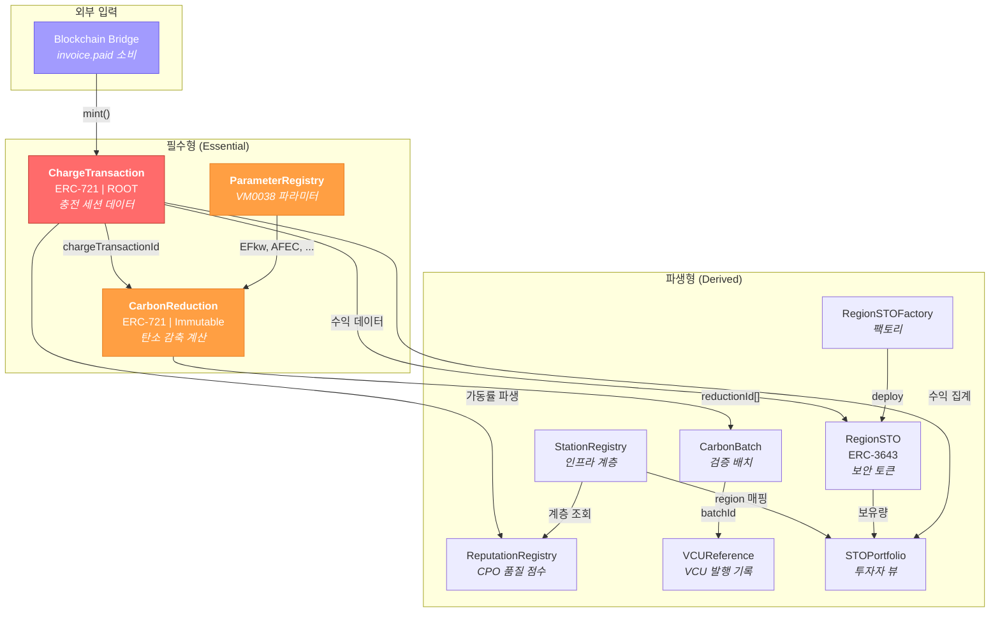

# Phase별 스마트 컨트랙트 구현 로드맵

## EV 충전 인프라 STO 프로젝트 — ChargeTransaction 중심 구현 전략

2026.02.27 | Ver 1.0 | 기밀

---

## 목차

1. [이중 서명 신뢰 모델](#1-이중-서명-신뢰-모델)
2. [컨트랙트 분류: 필수형 vs 파생형](#2-컨트랙트-분류-필수형-vs-파생형)
3. [ChargeTransaction 중심 의존성 그래프](#3-chargetransaction-중심-의존성-그래프)
4. [Phase별 구현 계획](#4-phase별-구현-계획)
5. [Phase 요약 테이블](#5-phase-요약-테이블)
6. [확정 정책 참조 (P1~P5)](#6-확정-정책-참조-p1p5)
7. [리스크 및 대응](#7-리스크-및-대응)

---

## 1. 이중 서명 신뢰 모델

온체인에 기록되는 충전 데이터의 신뢰는 **두 개의 서명 레이어**에 의해 보장됩니다. 각 레이어는 독립적으로 진화하며, Phase에 따라 신뢰 수준이 점진적으로 강화됩니다.

### 1.1 서명 레이어 구조

| 레이어 | 서명 주체 | 키 관리 | 서명 대상 | 온체인 저장 위치 | 검증 방법 | 보장 내용 |
|--------|----------|--------|----------|----------------|----------|----------|
| **Layer 1: HW/임베디드** | TPM 2.0 SE 칩 (회사 지정 모델) | 칩 내부 (추출 불가) | 원시 계측 데이터 (kWh, timestamps) | `ChargeSession.seSignature` 필드 | `ecrecover` 또는 P-256 precompile | 물리적 측정값의 출처 증명 — 데이터가 특정 물리 장치에서 특정 시점에 생성되었음을 암호학적으로 보장 |
| **Layer 2: 플랫폼** | Blockchain Bridge 지갑 | AWS KMS (HSM 기반, 평문 키 미노출) | `ChargeTransaction.mint()` 트랜잭션 전체 | Ethereum TX 자체의 (v, r, s) | `onlyBridge` modifier (`msg.sender` 검증) | 플랫폼 파이프라인 무결성 — 결제 완료(P1)된 건만 DERA 검증을 통과하여 온체인에 기록됨을 보장 |

### 1.2 Phase별 신뢰 모델 진화

| Phase | 시점 | Layer 1 (HW) | Layer 2 (플랫폼) | 신뢰 근거 |
|-------|------|-------------|-----------------|----------|
| **Phase 1** | ~2026.05 | ❌ 비활성 (`seSignature = 0x`) | ✅ `onlyBridge` + 결제 완료 게이트(P1) | DERA 이상치 탐지 + Bridge 권한 제어 + 결제 완료만 온체인 기록 |
| **Phase 2** | 2026.06~ | ✅ SE 서명 기록 (검증은 off-chain) | ✅ 동일 | SE 서명이 `seSignature` 필드에 저장. VVB가 off-chain에서 서명 검증 가능 |
| **Phase 3** | 2027.01~ | ✅ SE 서명 온체인 검증 | ✅ 동일 | 컨트랙트가 SE 서명을 직접 검증. 완전한 하드웨어 → 온체인 Chain of Trust 달성 |

> **정책 P4 적용**: SE 칩 탑재는 Phase 2 과제. Phase 1 신뢰 모델은 DERA + `onlyBridge` + 결제 완료 게이트.

### 1.3 데이터 흐름과 서명 지점

```
Phase 1:
  충전기(OCPP) → Gateway → DERA 검증 → 결제 → invoice.paid
    → Blockchain Bridge [Layer 2 서명: Bridge 지갑이 TX 서명]
      → ChargeTransaction.mint() [onlyBridge 검증]
        → seSignature = 0x (빈 bytes)

Phase 2+:
  충전기(OCPP) → SE 칩 [Layer 1 서명: 원시 데이터 서명] → Gateway → DERA 검증 → 결제 → invoice.paid
    → Blockchain Bridge [Layer 2 서명: Bridge 지갑이 TX 서명]
      → ChargeTransaction.mint() [onlyBridge 검증 + SE 서명 포함]
        → seSignature = SE 칩의 서명 데이터
```

### 1.4 Bookend 검증 모델 — 양 끝 서명으로 전체 경로 무결성 보장

두 서명은 데이터 경로의 **양 끝(bookend)**을 잡습니다. 중간 레이어 각각에 별도 서명을 넣지 않아도, 양 끝의 서명 데이터가 일치하면 전체 경로의 무결성이 보장됩니다.

```
[Layer 1: SE 서명]                                         [Layer 2: Bridge 서명]
      │                                                            │
  물리 측정                    중간 레이어                      온체인 기록
      │                          │                                 │
  SE 칩이 kWh,           Gateway → DERA                     AWS KMS가 TX
  timestamps에            → 결제 → invoice.paid              서명 후 제출
  서명 생성                                                  (onlyBridge 검증)
      │                                                            │
      └──── SE 서명 원본 데이터 vs 온체인 ChargeSession 비교 ────┘
                    일치 → 중간 경로 전체 무결성 증명
```

**VVB 감사관 검증 절차:**

| 검증 단계 | 질문 | 검증 수단 |
|----------|------|----------|
| 1 | 이 데이터가 실제 물리 장치에서 나왔는가? | SE 서명 검증 (`seSignature` → SE 공개키로 복원) |
| 2 | 인가된 플랫폼이 제출했는가? | Bridge TX 서명 검증 (TX의 `from` == `bridgeAddress`) |
| 3 | 중간에 변조되지 않았는가? | SE 서명 원본 데이터 vs 온체인 `ChargeSession` 데이터 비교 |

3단계에서 일치가 확인되면, 중간 경로(Gateway, DERA, 결제, Bridge)에서 데이터가 변조되지 않았음이 자동으로 증명됩니다.

### 1.5 AWS KMS 기반 Bridge 키 관리

Bridge 지갑의 private key는 AWS KMS의 HSM(Hardware Security Module) 내부에서만 존재합니다. 평문 키가 서버 메모리에 올라가지 않으며, `eth_sendRawTransaction` 시점에 KMS API 호출로 서명만 수신하는 구조입니다.

| 항목 | 내용 |
|------|------|
| **키 저장** | AWS KMS HSM (FIPS 140-2 Level 3) |
| **서명 방식** | KMS `Sign` API 호출 → ECDSA secp256k1 서명 반환 |
| **키 노출** | 서버 메모리에 평문 키 미노출. KMS 외부 추출 불가. |
| **접근 제어** | IAM 정책으로 Bridge 서비스만 서명 권한 부여 |
| **감사 추적** | CloudTrail에 모든 서명 요청 로깅 |
| **리스크 완화** | Bridge가 단일 hot wallet이라는 리스크를 HSM 수준 키 보호로 상쇄 |

---

## 2. 컨트랙트 분류: 필수형 vs 파생형

9개 스마트 컨트랙트(+ RegionSTOFactory)를 **데이터 생산/소비 관계**에 따라 두 범주로 분류합니다. 이 분류가 구현 우선순위의 근거입니다.

### 2.1 분류 기준

- **필수형 (Essential)**: 근본 데이터를 생산하거나, 근본 데이터의 직접적 계산 의존성인 컨트랙트. 이들이 없으면 시스템이 동작하지 않음.
- **파생형 (Derived)**: 필수형이 생산한 데이터를 소비·집계·변환하는 컨트랙트. 필수형에 의존하지만 역방향 의존성은 없음.

### 2.2 필수형 컨트랙트 (Essential) — 3개

| # | 컨트랙트 | 역할 | 분류 근거 |
|---|---------|------|----------|
| 2 | **ChargeTransaction** | 🔴 ROOT — 전체 시스템의 데이터 소스 | 모든 하위 컨트랙트의 원천 데이터 생산. ERC-721, 충전 세션당 1 토큰. `invoice.paid` → Bridge → `mint()` 경로로 데이터 유입. |
| 4 | **ParameterRegistry** | CarbonReduction의 필수 의존성 | VM0038 수식 적용에 필요한 파라미터(EFkw, EFfuel, AFEC, DCFC 효율, EV 효율) 저장. CarbonReduction이 이 값을 참조하지 않으면 탄소 감축 계산 불가. |
| 3 | **CarbonReduction** | ChargeTransaction과 1:1 계산 결과 | ChargeTransaction 데이터 + ParameterRegistry 파라미터로 VM0038 수식을 **온체인 내부 계산**(P5). 외부 데이터 불필요. Immutable 배포. |

> **의존성 체인**: `ChargeTransaction` → `ParameterRegistry` → `CarbonReduction`
> CarbonReduction은 ChargeTransaction과 ParameterRegistry 없이는 존재할 수 없습니다.

### 2.3 파생형 컨트랙트 (Derived) — 7개

| # | 컨트랙트 | 소비하는 데이터 | 분류 근거 |
|---|---------|---------------|----------|
| 1 | **StationRegistry** | N/A (독립 레지스트리) | Phase 1에서 ChargeTransaction은 Bridge 페이로드의 raw `bytes32`(chargerId, stationId, regionId 등)를 그대로 저장하므로, 온체인 계층 조회 불필요. Phase 2에서 계층 무결성 검증 필요 시 활성화. |
| 7 | **ReputationRegistry** | ChargeTransaction (가동률 등 파생 지표) | Oracle 패턴으로 off-chain 계산 결과를 온체인 기록. StationRegistry 존재 전제. |
| 5 | **CarbonBatch** | CarbonReduction 토큰 ID 목록 | VVB 검증 주기에 맞춰 CarbonReduction 레코드를 묶음. 이중 계산 방지. |
| 6 | **VCUReference** | CarbonBatch ID | Verra VCU 발행 결과의 온체인 기록. CarbonBatch 존재 전제. |
| 9 | **RegionSTO** | ChargeTransaction (수익 데이터) | ERC-3643 보안 토큰. `distributeRevenue()`로 충전 수익 배분. 증권법 시행 후 활성화. |
| — | **RegionSTOFactory** | N/A (팩토리) | RegionSTO 인스턴스 배포 전용. |
| 8 | **STOPortfolio** | RegionSTO, ChargeTransaction, StationRegistry | 투자자 포트폴리오 집계 뷰. 모든 파생형 중 가장 나중에 필요. |

### 2.4 필수형/파생형 판별 흐름

```
Q: 이 컨트랙트가 없으면 ChargeTransaction → CarbonReduction 파이프라인이 중단되는가?
  YES → 필수형
  NO  → Q: 이 컨트랙트가 필수형 데이터를 소비하는가?
          YES → 파생형
          NO  → 독립 유틸리티 (현재 아키텍처에 해당 없음)
```

---

## 3. ChargeTransaction 중심 의존성 그래프

ChargeTransaction이 전체 시스템의 중심임을 시각화합니다. 화살표 방향은 **데이터 흐름 방향** (데이터 소스 → 데이터 소비자)입니다.



### 의존성 요약

| 컨트랙트 | 의존 대상 | 의존 방향 |
|---------|----------|----------|
| CarbonReduction | ChargeTransaction, ParameterRegistry | ← 필수 의존 |
| CarbonBatch | CarbonReduction | ← 필수 의존 |
| VCUReference | CarbonBatch | ← 필수 의존 |
| ReputationRegistry | ChargeTransaction, StationRegistry | ← 데이터 소비 |
| RegionSTO | ChargeTransaction (수익) | ← 데이터 소비 |
| STOPortfolio | RegionSTO, ChargeTransaction, StationRegistry | ← 집계 뷰 |
| StationRegistry | 없음 (독립) | — |
| ParameterRegistry | 없음 (독립) | — |
| ChargeTransaction | 없음 (ROOT) | — |

---

## 4. Phase별 구현 계획

### Phase 1a: ChargeTransaction (즉시 착수)

**목표**: 전체 시스템의 ROOT 데이터 소스를 온체인에 확립

| 항목 | 내용 |
|------|------|
| **컨트랙트** | ChargeTransaction |
| **토큰 표준** | ERC-721 + Metadata (ERC-165) |
| **타임라인** | 즉시 착수 ~ 2026.04 |
| **온체인 의존성** | 없음 — Bridge 페이로드 데이터를 그대로 저장 |

**핵심 설계 결정:**

1. **`onlyBridge` 접근 제어**: `mint()`는 Blockchain Bridge 지갑만 호출 가능 (P2: `invoice.paid` 시점에 기록).

2. **`seSignature` 필드는 optional**: Phase 1에서는 빈 bytes (`0x`)로 저장. Phase 2에서 SE 칩 탑재 시 활성화 (P4).

3. **`invoice.paid` 페이로드 → `ChargeSession` struct 매핑**:

```
invoice.paid 페이로드              →  ChargeSession struct
─────────────────────────────────────────────────────────
charging.energy_delivered_kwh      →  energyKwh (uint256, ×100 스케일링)
charging.charging_started_at       →  startTimestamp (uint256, Unix)
charging.charging_stopped_at       →  endTimestamp (uint256, Unix)
charger_id (UUID)                  →  chargerId (bytes32)
station_id (UUID)                  →  stationId (bytes32) — Phase 1 raw 저장
region_id (ISO 3166-2:KR)         →  gridRegionCode (bytes4)
cpo_id (UUID)                      →  cpoId (bytes32)
session_id (UUID)                  →  sessionId (bytes32) — tokenId 매핑
(Bridge DB lookup)                 →  chargerType (uint8) — L1/L2/DCFC
(Bridge DB lookup / UNKNOWN)       →  vehicleCategory (uint8)
0x (빈 bytes)                      →  seSignature (bytes) — Phase 2 활성화
```

4. **데이터 변환 책임**: Bridge가 모든 변환 수행 (kWh→uint256, ISO 8601→Unix, UUID→bytes32, region_id→bytes4). 컨트랙트는 변환된 값을 그대로 저장.

5. **StationRegistry 불필요**: Phase 1에서는 `stationId`, `chargerId`, `cpoId` 등을 Bridge 페이로드의 raw `bytes32`로 저장. 온체인에서 계층 구조를 조회할 필요가 없음.

**`ChargeSession` struct (Phase 1):**

```solidity
struct ChargeSession {
    bytes32 sessionId;         // 충전 세션 고유 ID
    bytes32 chargerId;         // 충전기 ID
    uint8   chargerType;       // 0: L1, 1: L2, 2: DCFC
    uint256 energyKwh;         // kWh × 100 (6.780 kWh → 678)
    uint256 startTimestamp;    // Unix timestamp
    uint256 endTimestamp;      // Unix timestamp
    uint8   vehicleCategory;   // 0: UNKNOWN, 1: BEV, 2: PHEV
    bytes4  gridRegionCode;    // ISO 3166-2:KR (예: 0x4b523131 = "KR-11")
    bytes32 cpoId;             // CPO ID
    bytes32 stationId;         // Station ID (raw, Phase 1)
    bytes   seSignature;       // TPM 2.0 SE 서명 (Phase 1: 0x)
}
```

**핵심 함수:**

```solidity
function mint(ChargeSession calldata session) external onlyBridge returns (uint256 tokenId)
function getSession(uint256 tokenId) external view returns (ChargeSession memory)
```

**이벤트:**

```solidity
event ChargeSessionRecorded(
    uint256 indexed tokenId,
    bytes32 indexed sessionId,
    bytes32 indexed chargerId,
    bytes4  gridRegionCode,
    uint256 energyKwh,
    uint256 startTimestamp,
    uint256 endTimestamp
);
```

---

### Phase 1b: ParameterRegistry + CarbonReduction (Phase 1a 직후)

**목표**: 온체인 내부 계산으로 VM0038 탄소 감축 기록 생성 (P5)

| 항목 | 내용 |
|------|------|
| **컨트랙트** | ParameterRegistry, CarbonReduction |
| **토큰 표준** | CarbonReduction: ERC-721 + Metadata (Immutable) |
| **타임라인** | Phase 1a 완료 직후 ~ 2026.05 |
| **온체인 의존성** | ChargeTransaction (Phase 1a) |

#### ParameterRegistry

버전 관리 파라미터 저장소. CarbonReduction의 필수 의존성.

**관리 파라미터:**

| 파라미터 | 키 (bytes32) | 업데이트 주기 | 설명 |
|---------|-------------|-------------|------|
| EFkw | `keccak256("EFkw")` | 연간 | 전력망 배출계수 (tCO2/kWh) |
| EFfuel | `keccak256("EFfuel")` | 기준연도 | 기준 연료 배출계수 (tCO2/L) |
| AFEC | `keccak256("AFEC")` | 5년 | 평균 연비 (km/L) |
| DCFC_EFF | `keccak256("DCFC_EFF")` | 고정 | 0.923 (DCFC 효율) |
| EV_EFF | `keccak256("EV_EFF")` | 수시 | EV 효율 (km/kWh) |

**핵심 함수:**

```solidity
setParameter(bytes32 key, uint256 value, uint256 effectiveFrom) — onlyAdmin
getParameter(bytes32 key, uint256 timestamp)                     — view (시점별 조회)
getParameterHistory(bytes32 key)                                  — view (전체 이력)
```

**설계 핵심**: VVB 감사 시 "특정 충전 세션에 어떤 파라미터 값이 적용되었는가?"를 검증 가능해야 함. `effectiveFrom` 타임스탬프 기반 버전 관리가 핵심.

#### CarbonReduction

ChargeTransaction 데이터 + ParameterRegistry 파라미터로 VM0038 수식을 적용하여 탄소 감축량을 계산 (P5: 온체인 내부 계산, 외부 데이터 불필요).

**VM0038 핵심 수식:**

```
Net Reduction = Baseline Emissions − Project Emissions
  Baseline = EC × (AFEC⁻¹) × EFfuel    (ICE 차량 동등 배출)
  Project  = EC × EFkw × (chargerType == DCFC ? 1/0.923 : 1)    (EV 충전 전력 배출)
  Leakage  = 0    (VM0038/AMS-III.C 기준)
```

여기서 `EC` = `ChargeTransaction.energyKwh`

**`ReductionRecord` struct:**

```solidity
struct ReductionRecord {
    uint256 chargeTransactionId;  // ChargeTransaction 토큰 ID (1:1 참조)
    uint256 baselineEmissions;    // gCO2 (ICE 동등)
    uint256 projectEmissions;     // gCO2 (전력망)
    uint256 netReduction;         // gCO2 (순 감축)
    uint256 appliedEFkw;          // 적용된 전력망 배출계수
    uint256 appliedEFfuel;        // 적용된 연료 배출계수
    uint256 appliedAFEC;          // 적용된 평균 연비
    uint256 evEfficiency;         // 적용된 EV 효율
}
```

**Immutable 배포**: 업그레이드 프록시 패턴 적용 금지. 방법론 개정 시 새 버전 컨트랙트를 별도 배포하고, 타임스탬프 경계로 구분. VVB가 배포된 바이트코드를 검증하여 수식 일관성을 확인.

---

### Phase 2: StationRegistry + ReputationRegistry (2026년 6월, 충전기 런칭)

**목표**: 물리 인프라 계층 구조 온체인 확립 및 CPO 운영 품질 추적 개시

| 항목 | 내용 |
|------|------|
| **컨트랙트** | StationRegistry, ReputationRegistry |
| **타임라인** | 2026.06~ (충전기 런칭과 동시) |
| **온체인 의존성** | StationRegistry: 없음 (독립) / ReputationRegistry: StationRegistry, ChargeTransaction |

#### StationRegistry

Region → CPO → Station → Charger 4단계 계층 구조를 온체인에 기록.

**Phase 2에서 필요한 이유:**

- 실제 충전기가 배포되면 물리적 계층 관계의 온체인 관리가 필요
- ReputationRegistry가 station 단위로 품질 점수를 기록하므로, station 존재 검증 필요
- STO 투자자 투명성: region 내 station 목록 조회
- Phase 1에서는 Bridge 페이로드의 raw `bytes32`로 충분했으나, Phase 2부터 계층 무결성 검증 필요

**핵심 함수:**

```solidity
registerRegion(bytes4 regionId, string calldata regionName) — onlyAdmin
registerStation(bytes32 stationId, bytes32 location, address cpoAddress, bytes4 regionId) — onlyAdmin
registerCharger(bytes32 chargerId, uint8 chargerType, bytes32 parentStationId) — onlyAdmin
getStationsByRegion(bytes4 regionId) — view
getChargersByStation(bytes32 stationId) — view
getRegion(bytes32 stationId) — view (station → region 매핑)
```

#### ReputationRegistry

Oracle 패턴으로 CPO 운영 품질 점수를 온체인 기록. ERC-8004 Reputation Registry 패턴 차용.

**기록 지표:**

| 지표 | 설명 | 산출 방식 |
|------|------|----------|
| 가동률 (uptimeScore) | 충전기 가용 시간 비율 | off-chain 계산 → Oracle 기록 |
| 고장빈도 (failureScore) | 단위 기간 고장 횟수 | off-chain 계산 → Oracle 기록 |
| 평균수리시간 (repairTimeScore) | 고장 → 복구 평균 소요 시간 | off-chain 계산 → Oracle 기록 |

**핵심 함수:**

```solidity
updateScore(bytes32 cpoId, bytes32 stationId, uint256 uptimeScore, uint256 failureScore, uint256 repairTimeScore) — onlyOracle
getStationReputation(bytes32 stationId) — view
getRegionScore(bytes4 regionId) — view (가중 평균 집계)
```

**Region-level 집계**: `getRegionScore`는 StationRegistry에서 region 내 모든 station을 조회하고, 각 station의 점수를 가중 평균하여 region 수준 품질 지표를 제공. STO 투자자가 region의 운영 건전성을 평가하는 데 사용.

---

### Phase 3: 투자 및 탄소시장 레이어 (2027년 1월)

**목표**: 전자증권법 시행에 맞춰 STO 토큰 활성화 및 VCM 파이프라인 구축

| 항목 | 내용 |
|------|------|
| **타임라인** | 2027.01~ (전자증권법 시행) |
| **전제 조건** | Phase 1, 2의 모든 컨트랙트 배포 완료 및 데이터 축적 (2026.06~12 약 6개월) |

#### Phase 3a: RegionSTO + RegionSTOFactory (ERC-3643)

**RegionSTO**: 행정구역별 보안 토큰. ERC-3643 (T-REX) 표준 준수 (P3).

- 17개 행정구역 (ISO 3166-2:KR) 각각에 1개 컨트랙트
- 토큰 심볼: `ELEC-SEOUL`, `ELEC-BUSAN`, `ELEC-GYEONGGI` 등
- 토큰 가격: 500 KRW/토큰
- Dynamic Supply: 인프라 확장 시 추가 민팅

**ERC-3643 하위 컨트랙트:**

| 하위 컨트랙트 | Phase 3 구현 수준 | 운영 주체 |
|-------------|-----------------|----------|
| IdentityRegistry | 증권사 KYC/AML 시스템 연동 | 증권사 |
| ComplianceModule | 증권사 요구사항 기반 전송 규칙 | 증권사 |
| TrustedIssuersRegistry | 증권사 주소 등록 | 플랫폼 Admin |
| ClaimTopicsRegistry | 투자자 적격성 요건 정의 | 플랫폼 Admin |

> Phase 1에서 ERC-3643 인터페이스(IIdentityRegistry, ICompliance 등)만 정의. Phase 3에서 증권사 협의를 거쳐 실 구현.

**발행인-증권사 역할 분리:**

| 역할 | 주체 | 온체인 범위 |
|------|------|-----------|
| 토큰 발행 (민팅) | 발행인 (회사) | `RegionSTO.mint()` |
| 수익 데이터 기록 | 발행인 (회사) | `distributeRevenue()` — Bridge 호출 |
| KYC/AML, 투자자 적격성 | 증권사 | IdentityRegistry 운영 |
| 배당 계산·집행 | 증권사 | off-chain (온체인 수익 데이터 참조) |
| 문서 관리 | 증권사 | off-chain |

> ~~ERC-2222~~ (배당), ~~ERC-1643~~ (문서 관리) 제외 — 증권사 영역.

**RegionSTOFactory**: 17개 RegionSTO 인스턴스를 표준화 배포하는 팩토리.

```solidity
deployRegionSTO(bytes4 regionId, string calldata regionName, string calldata tokenSymbol, address[] calldata holders, uint256[] calldata tokenAmounts, address bridgeAddress) — onlyAdmin
getContract(bytes4 regionId) — view
```

#### Phase 3b: STOPortfolio

투자자 포트폴리오 집계 뷰. 증권사가 온체인 데이터를 직접 참조하는 인터페이스.

**경량화 설계** (ERC 표준 분석 보고서 권고 반영): 핵심 뷰 함수만 온체인, 복잡한 집계는 off-chain 인덱서로 위임.

```solidity
getRegionHolding(address investor, bytes4 regionId) — view
getInvestorRegions(address investor) — view
getRegionStationBreakdown(bytes4 regionId, uint256 period) — view
```

#### Phase 3c: CarbonBatch + VCUReference

**CarbonBatch**: VVB 검증 주기에 맞춰 CarbonReduction 레코드를 배치로 묶고, 잠금(lock)하여 이중 계산 방지.

```solidity
createBatch(uint256 timeStart, uint256 timeEnd) — onlyAdmin
addToBatch(uint256 batchId, uint256[] calldata reductionIds) — onlyAdmin
lockBatch(uint256 batchId) — onlyAdmin (비가역적)
```

상태 전이: `OPEN` → `LOCKED` → `VERIFIED` (단방향)

**VCUReference**: Verra VCU 발행 결과의 온체인 기록. CarbonBatch와 분리 — 내부 운영(CarbonBatch)과 외부 인증(Verra)의 신뢰 모델이 다르므로.

```solidity
struct VCURecord {
    uint256 batchId;
    uint256 vcuQuantity;
    string  verraRegistryNumber;
    uint256 issuanceDate;
    bytes32 verificationHash;
}
```

---

### Phase 4: 확장 및 고도화 (2027 H2~)

**목표**: 하드웨어 신뢰 완성, 확장성 강화, 크로스체인 연결

| 항목 | 내용 | 타임라인 |
|------|------|---------|
| **SE 서명 온체인 검증** | P-256 precompile(RIP-7212) 또는 라이브러리를 Avalanche L1에 배포. `ChargeTransaction.mint()` 내에서 SE 서명 직접 검증. | 2027 H2 |
| **크로스체인 브릿지 (AWM)** | Avalanche Warp Messaging으로 퍼블릭 C-Chain 연결. VCU의 공개 시장 거래 지원. | 2027 H2~ |
| **Pull-based Accumulator 패턴** | `distributeRevenue()`의 홀더 루프를 글로벌 accumulator로 전환. 홀더 수 증가 시 block gas limit 문제 방지. | 홀더 수 임계치 도달 시 |
| **K-ETS 경로 탐색** | 07A-004 방법론 개발. 충전 운영자용 배출권거래제 참여. | 2027 H2~ |
| **Gold Standard 이중 등록** | Verra VCS + Gold Standard 이중 등록으로 프리미엄 탄소배출권 확보. | 2028~ |

**Pull-based Accumulator 패턴 상세:**

현재 `distributeRevenue()`:
```solidity
// O(n) — 홀더 수에 비례하여 가스 소비 증가
for (uint i = 0; i < holders.length; i++) {
    claimable[holders[i]] += (amount * tokenBalances[holders[i]]) / totalSupply;
}
```

Accumulator 패턴 전환 후:
```solidity
// O(1) — 홀더 수 무관
revenuePerToken += (amount * PRECISION) / totalSupply;  // 글로벌 값만 업데이트
// 개별 계산은 claim() 시점에 수행
```

> 프라이빗 체인(가스비 0)에서도 block gas limit은 존재하므로, 홀더 수가 수천 명을 초과하면 전환 필요.

---

## 5. Phase 요약 테이블

| Phase | 컨트랙트 | 분류 | 타임라인 | 핵심 트리거 |
|-------|---------|------|---------|-----------|
| **1a** | ChargeTransaction | 필수형 | 즉시 ~ 2026.04 | 즉시 착수 (ROOT 데이터 소스) |
| **1b** | ParameterRegistry, CarbonReduction | 필수형 | 2026.04 ~ 05 | Phase 1a 완료 |
| **2** | StationRegistry, ReputationRegistry | 파생형 | 2026.06~ | 충전기 런칭 |
| **3a** | RegionSTO, RegionSTOFactory | 파생형 | 2027.01~ | 전자증권법 시행 |
| **3b** | STOPortfolio | 파생형 | 2027.01~ | 증권사 온보딩 |
| **3c** | CarbonBatch, VCUReference | 파생형 | 2027.01~ | VVB 검증 개시 |
| **4** | (SE 검증, AWM, Accumulator) | 고도화 | 2027 H2~ | 확장 임계치 도달 |

### 전체 9+1 컨트랙트 배정 검증

| # | 컨트랙트 | Phase | 분류 | ✅ |
|---|---------|-------|------|---|
| 1 | StationRegistry | 2 | 파생형 | ✅ |
| 2 | ChargeTransaction | 1a | 필수형 | ✅ |
| 3 | CarbonReduction | 1b | 필수형 | ✅ |
| 4 | ParameterRegistry | 1b | 필수형 | ✅ |
| 5 | CarbonBatch | 3c | 파생형 | ✅ |
| 6 | VCUReference | 3c | 파생형 | ✅ |
| 7 | ReputationRegistry | 2 | 파생형 | ✅ |
| 8 | STOPortfolio | 3b | 파생형 | ✅ |
| 9 | RegionSTO | 3a | 파생형 | ✅ |
| — | RegionSTOFactory | 3a | 파생형 | ✅ |

**ChargeTransaction이 Phase 1a의 유일한 컨트랙트**임을 확인.

---

## 6. 확정 정책 참조 (P1~P5)

아래 정책은 `docs/platform/questions-for-platform-team.md`에서 확정되었으며, 각 Phase의 설계 결정에 직접 반영됩니다.

| # | 정책 | 적용 Phase | 설계 영향 |
|---|------|-----------|----------|
| **P1** | 결제 완료 건만 온체인 기록 | Phase 1a | `ChargeTransaction.mint()`는 `invoice.paid` 이벤트에서만 트리거. 결제 실패 건은 온체인에 기록되지 않음. VVB 감사 시 데이터 순도 보장. |
| **P2** | `invoice.paid` 시점에 통합 기록 | Phase 1a, 3a | `invoice.paid` → Bridge → `ChargeTransaction.mint()` + `distributeRevenue()` 동시 처리. 단일 트리거에서 두 파이프라인 실행. |
| **P3** | RegionSTO는 ERC-3643 발행 | Phase 3a | ERC-3643 하위 컨트랙트는 Phase 1에서 인터페이스만 정의, Phase 3에서 증권사 협의 후 구현. 최소 허용 구현으로 시작. |
| **P4** | SE 서명은 Phase 2 | Phase 1a, 2, 4 | Phase 1: `seSignature = 0x` (빈 bytes). Phase 2: SE 서명 저장 시작. Phase 4: 온체인 검증 활성화. |
| **P5** | ChargeTransaction → CarbonReduction은 온체인 내부 계산 | Phase 1b | CarbonReduction은 ChargeTransaction 데이터 + ParameterRegistry 파라미터만으로 VM0038 수식 적용. 외부 오라클 불필요. |

### 정책과 Phase의 교차 매핑

```
P1 (결제 완료만) ─────→ Phase 1a: onlyBridge + invoice.paid 게이트
P2 (통합 기록)   ─────→ Phase 1a: mint() / Phase 3a: distributeRevenue()
P3 (ERC-3643)   ─────→ Phase 3a: RegionSTO 구현
P4 (SE Phase 2) ─────→ Phase 1a: 빈 bytes / Phase 2: 저장 / Phase 4: 검증
P5 (내부 계산)   ─────→ Phase 1b: CarbonReduction 구현
```

---

## 7. 리스크 및 대응

### 7.1 Phase 1 리스크

| 리스크 | 영향도 | 대응 |
|--------|-------|------|
| `invoice.paid` 페이로드에 `chargerType`, `vehicleCategory` 누락 | 🟡 High | Bridge가 플랫폼 DB에서 조회하여 보완. 불가 시 `UNKNOWN`으로 기본값 처리, VM0038 보수적 파라미터 적용. (질의서 2.2, 2.3) |
| Bridge에서 `ChargeTransaction.mint()` + `distributeRevenue()` 이중 호출 불가 | 🔴 Critical | 라우터 컨트랙트 제공으로 단일 TX로 양쪽 호출 가능하게 설계. (질의서 1.1b) |
| Chain ID 미확정 (`424242` vs `270626`) | 🔴 Critical | STRIKON 플랫폼팀 응답 대기 중. 확정 전까지 환경 변수로 관리. (질의서 6.1) |
| UUID → bytes32 인코딩 규칙 미확정 | 🟡 High | UTF-8 hex 인코딩 vs `keccak256(abi.encodePacked())` — 플랫폼팀 확인 필요. (질의서 6.2) |

### 7.2 Phase 2 리스크

| 리스크 | 영향도 | 대응 |
|--------|-------|------|
| SE 칩 서명 알고리즘 미확정 | 🟢 Medium | P-256(secp256r1) 예상. RIP-7212 precompile 또는 Solidity 라이브러리 사전 준비. (질의서 3.1b) |
| StationRegistry 도입 시 기존 ChargeTransaction 데이터와의 정합성 | 🟡 High | Phase 1 데이터는 raw `bytes32`로 저장되어 있으므로, StationRegistry 배포 후 migration 불필요. 새 데이터부터 계층 검증 적용. |
| OCPP 1.6 충전기 오프라인 시 데이터 지연 | 🟡 High | `MAX_DELAY` 파라미터로 데이터 신선도 검증. 임계값은 플랫폼팀 응답에 따라 결정. (질의서 4.3b) |

### 7.3 Phase 3 리스크

| 리스크 | 영향도 | 대응 |
|--------|-------|------|
| 증권사 파트너십 지연 | 🔴 Critical | ERC-3643 인터페이스를 Phase 1에서 미리 정의. 최소 허용 구현(단순 whitelist)으로 시작, 증권사 온보딩 시 교체/강화. |
| `distributeRevenue()` 홀더 루프 gas limit 초과 | 🟡 High | 예상 최대 홀더 수 확인 필요 (질의서 6.4a). Pull-based accumulator 패턴을 Phase 4로 계획하되, 초기부터 인터페이스는 호환되게 설계. |
| KRW → AVAX 환율 변동 | 🟡 High | 환율 소스·업데이트 주기 확인 필요 (질의서 6.3). 환율 ID를 온체인 이벤트에 포함하여 감사 추적 가능하게 설계. |

### 7.4 리스크 대응 우선순위

```
🔴 Critical (Phase 1 착수 전 해결 필수):
  1. Bridge의 이중 컨트랙트 호출 가능 여부 (질의서 1.1)
  2. Chain ID 확정 (질의서 6.1)

🟡 High (Phase 1 개발 중 병행 해결):
  3. invoice.paid 추가 필드 (질의서 2.1~2.3)
  4. UUID → bytes32 인코딩 규칙 (질의서 6.2)
  5. MAX_DELAY 파라미터 (질의서 4.3)

🟢 Medium (Phase 2 전까지 해결):
  6. SE 칩 기술 사양 (질의서 3.1)
  7. Bridge 확장성 (질의서 4.1)
```

---

## 참조 문서

| 문서 | 경로 | 참조 내용 |
|------|------|----------|
| Smart Contract Architecture | `CLAUDE.md` §4-7 | 9 컨트랙트 아키텍처, 의존성, 데이터 흐름 |
| Smart Contract Spec | `docs/contracts/smart-contract-spec.md` | ChargeSession struct, ReductionRecord struct, 함수 시그니처 |
| Interface Spec (Korean) | `STRIKON_STO_Interface_Spec_v1.0.md` | invoice.paid 페이로드 (Step ⑤-⑥), Bridge 아키텍처 |
| 플랫폼팀 질의서 | `docs/platform/questions-for-platform-team.md` | 확정 정책 P1~P5, 미해결 질의 사항 |
| ERC 표준 분석 | `docs/contracts/erc-standards-analysis.md` | ERC 표준 매핑, STOPortfolio 경량화 권고 |
| Architecture | `docs/context/architecture.md` | 4-layer 시스템 아키텍처, 보안 모델 |

---

*End of Document*
